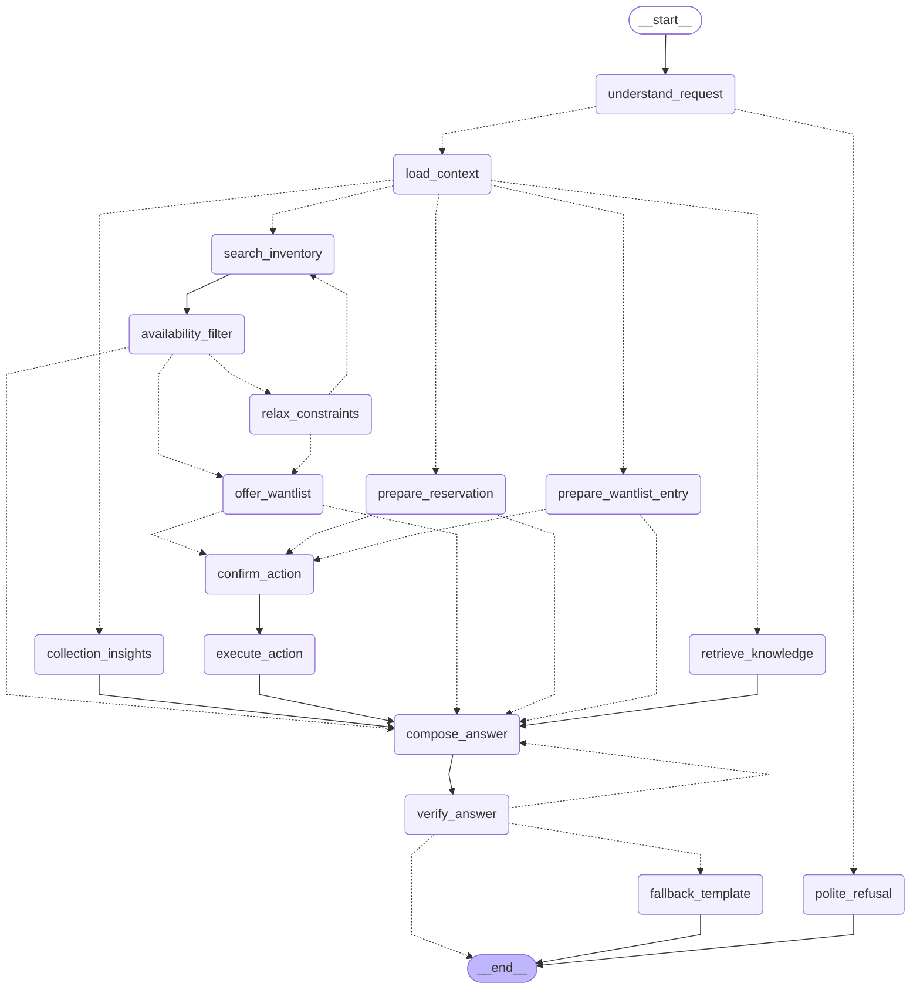

# Store assistant graph

Generated by `python -m scripts.draw_graph` from the compiled LangGraph graph. Dotted arrows are conditional (decided by `app/ai/routing.py`).

```mermaid
---
config:
  flowchart:
    curve: linear
---
graph TD;
	__start__([<p>__start__</p>]):::first
	understand_request(understand_request)
	polite_refusal(polite_refusal)
	load_context(load_context)
	search_inventory(search_inventory)
	availability_filter(availability_filter)
	relax_constraints(relax_constraints)
	offer_wantlist(offer_wantlist)
	retrieve_knowledge(retrieve_knowledge)
	collection_insights(collection_insights)
	prepare_reservation(prepare_reservation)
	prepare_wantlist_entry(prepare_wantlist_entry)
	confirm_action(confirm_action)
	execute_action(execute_action)
	compose_answer(compose_answer)
	verify_answer(verify_answer)
	fallback_template(fallback_template)
	__end__([<p>__end__</p>]):::last
	__start__ --> understand_request;
	availability_filter -.-> compose_answer;
	availability_filter -.-> offer_wantlist;
	availability_filter -.-> relax_constraints;
	collection_insights --> compose_answer;
	compose_answer --> verify_answer;
	confirm_action --> execute_action;
	execute_action --> compose_answer;
	load_context -.-> collection_insights;
	load_context -.-> prepare_reservation;
	load_context -.-> prepare_wantlist_entry;
	load_context -.-> retrieve_knowledge;
	load_context -.-> search_inventory;
	offer_wantlist -.-> compose_answer;
	offer_wantlist -.-> confirm_action;
	prepare_reservation -.-> compose_answer;
	prepare_reservation -.-> confirm_action;
	prepare_wantlist_entry -.-> compose_answer;
	prepare_wantlist_entry -.-> confirm_action;
	relax_constraints -.-> offer_wantlist;
	relax_constraints -.-> search_inventory;
	retrieve_knowledge --> compose_answer;
	search_inventory --> availability_filter;
	understand_request -.-> load_context;
	understand_request -.-> polite_refusal;
	verify_answer -.-> __end__;
	verify_answer -.-> compose_answer;
	verify_answer -.-> fallback_template;
	fallback_template --> __end__;
	polite_refusal --> __end__;
	classDef default fill:#f2f0ff,line-height:1.2
	classDef first fill-opacity:0
	classDef last fill:#bfb6fc
```
